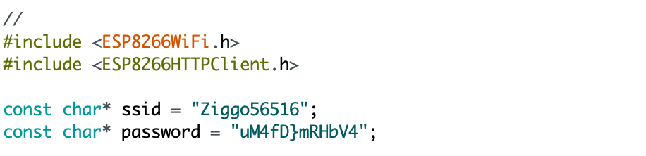
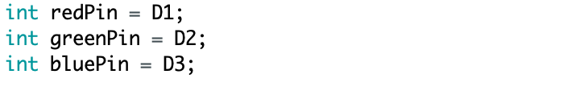
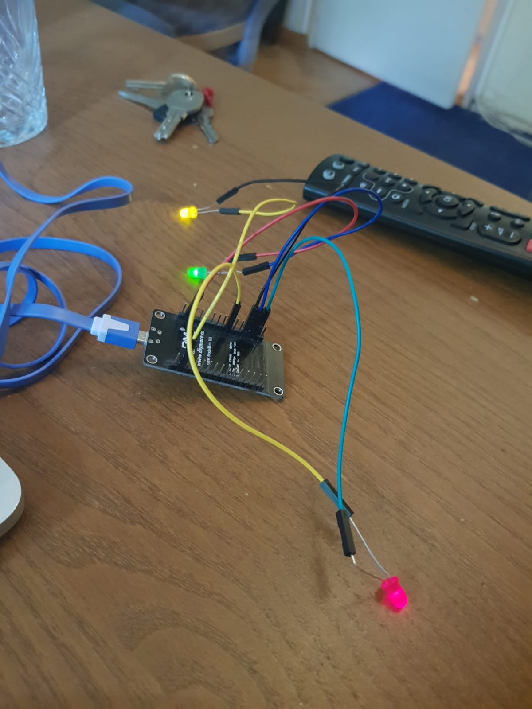
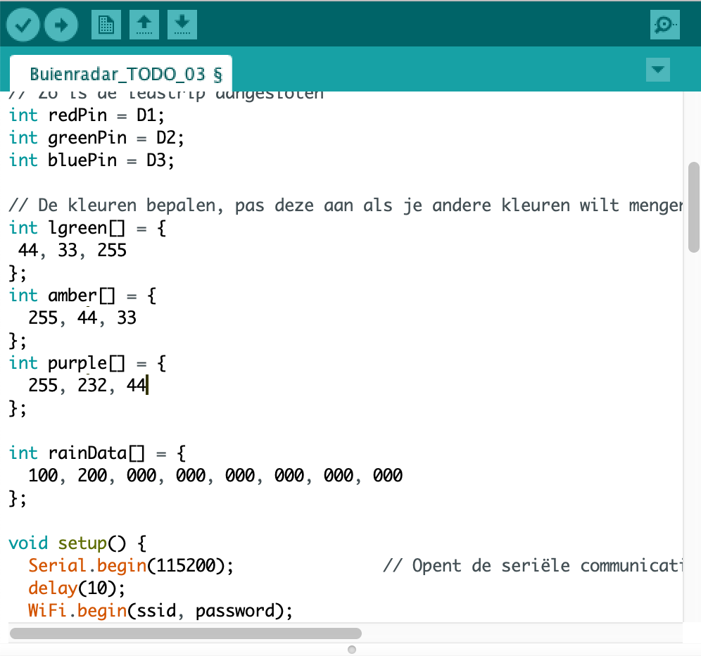
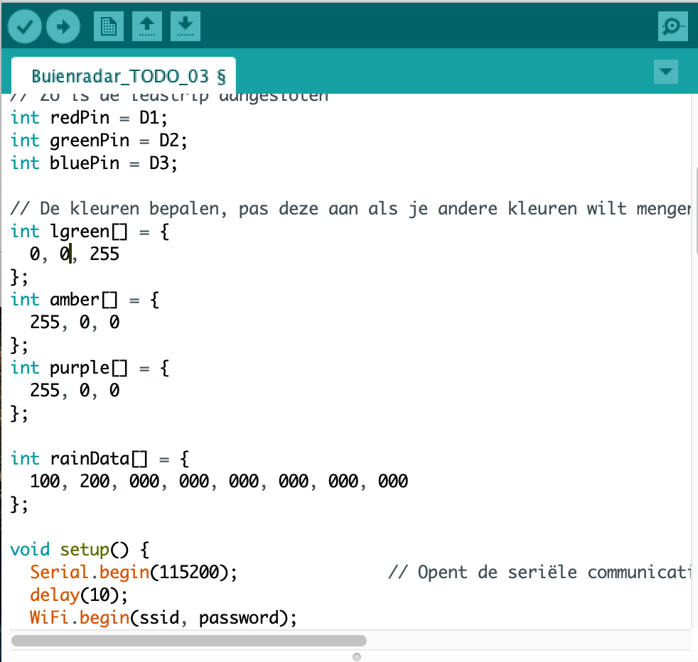
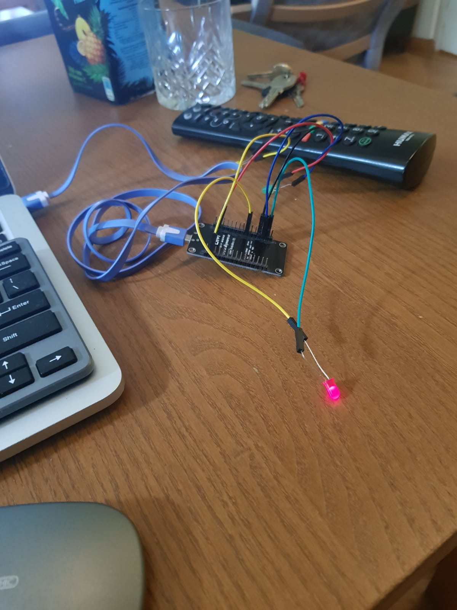
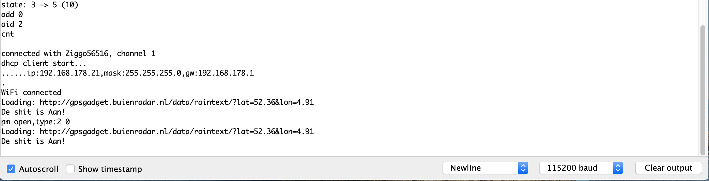

# Todo 03 Buienradar
**Auteur:** -Jesse de vries-

In this document I will connect a notemcu with 3 led sensors (3 colors) to an external API

This is based on the how to provided by Harm van Vugt you can find here: https://drive.google.com/drive/folders/0B7p3-OuR5YG0dWJNTW12MFdiYUk

## Step 01 

Open Buienradar.ino change the following parameters to your own WiFi details.

## Step 02

In the Buienradar.ino where 3 different serial states: Het is droog!, Het regent!, Shit is aan!. I wanted to attached every state to a different led.

## Step 03 

### Eror

When I activated the program I was happy to find out that the signal from the API was legit. But all the lamps where lighting up instead of one.

### Solution

I found out that within the RGB parameters changes was needed. 

I change it to this.

## Step 04

### conclusion

It works! Now I know whenever it rains based on the light.
(images/Schermafbeelding 2020-10-05 om 13.40.33.png)

